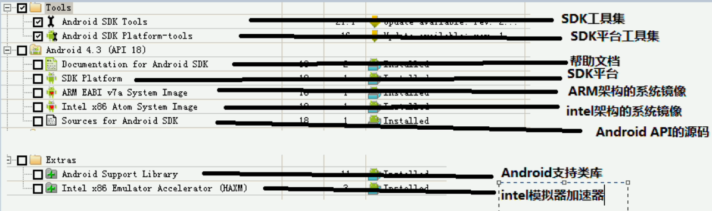

# AndroidNote

## Android 的发展和历史

### Android 进化史

- 1.5 Cupcake(纸杯蛋糕) —— API 3
- 1.6 Donut(甜甜圈) —— API 4
- 2.1 Eclair(闪电泡芙) —— API 7
- 2.2 Froyo(冻酸奶) —— API 8
- 2.3 Gingerbread(姜饼) —— API 9
- 3.0 Honeycomb(蜂巢) —— API 11
- 4.0 Ice cream SandWich(冰淇淋三明治) —— API 14
- 4.1 Jelly Bean(果冻豆) —— API 16
- 4.2 Jelly Bean(果冻豆) —— API 17
- 4.3 Jelly Bean(果冻豆) —— API 18
- 4.4 Kitkat(雀巢的一款巧克力) —— API 20
- 5.0 Lollipop(棒棒糖) Android L —— API 21
- 6.0 Marshmallow(棉花糖) Android M —— API 23
- 7.0 Nougat(牛轧糖)（Android N） —— API 24
- 8.0 Oreo(奥利奥)（Android O） —— API 26
- 9.0 Pie(馅饼) （Android P） —— API 28

### Android的发展和简介

1. Android 公司的创始人 Andy Rubin
2. Google 收购，Andy Rubin 称为 Android 产品负责人
3. 2007-11-5 发布 Android 1.0 手机操作系统 （没有赢得广泛的市场支持）
4. 2009-5 发布 Android 1.5 —— 提供界面、蓝牙连接支持。吸引大量的开发者目光。
5. 2009-9-22 T-Mobile 在纽约发布第一款 Android 手机—— T-Mobile G1
6. 2010-1-7 Google 发布合作品牌手机 Nexus One(HTC G5)

### 常见的手机系统

- iOS: Appgle 公司的手机、平台操作系统
- Android: Google 开源的手机操作系统，广泛用于TV、手表以及各种可穿戴设备

### 搭载 Android 系统的手机厂商

- 三星
- HTC
- 索尼爱立信
- LG
- 华为
- 联想
- 中兴
- 小米

## Android 5.x 平台架构与特性

> 由操作系统、中间件、用户界面和应用软件组成。它采用软件叠层的方式进行构建。层与层之间相互分离，明确各层的分工。保证了层与层之间的低耦合，当下层的层内与层下发生改变时，上层应用程序无需任何改变。

- 1. **应用程序层**：核心应用程序（Java编写的），编写Android 系统上的应用程序
  - 电子邮件客户端
  - SMS程序
  - 日历
  - 地图
  - 浏览器
  - 联系人
- 2. **应用程序框架**：Android 提供的 API 框架
  - 应用程序开发的基础
  - 发布应用程序的功能模块——遵守框架约定，其他应用程序就可以使用功能模块
- 3. **函数库**：一套被不同组件所使用的 **C/C++ 库的集合**。开发者不能直接调用C/C++库集，但可以用应用程序框架来调用这些库。
  - **系统 C 库**：**标准 C 系统库（libc）**，为嵌入式 Linux 设备调整过
  - 媒体库：基于 **PacketVideo 的 OpenCORE**。支持**播放和录制音乐或视频，以及查看静态图片**。
    - MPEG4、H.264、MP#、AAC、AMR、JPG、PNG
  - **Surface Manager**：管理对显示**子系统的访问**，并可以对多个应用程序的 2D 和 3D 图层提供无缝整合
  - **LibWebCore**: Web浏览器引擎，为**WebView**提供支持。
  - **SGL**：底层的 **2D 图形引擎**
  - **3D libraries**: 基于 **OpenGL ES API** 实现的 3D 系统，使用**硬件 3D 加速**，页可以使用高度优化的**软件 3D 加速**
  - **FreeType**：**位图和向量字体**显示
  - **SQLite**：供应用程序使用的轻量级**关系数据库**
- 4. **Android 运行时**：两部分组成
  - **核心库集**：提供Java语言核心库
  - **虚拟机**：负责运行 Android 应用程序
    - **Dalvik** 虚拟机：采用 **JIT** (Just-in-time)的解释器进行动态编译并执行，因此导致**运行时比较慢**
    - **ART 模式**：用户**安装 APP 时进行预编译**(Ahead-of-time，**AOT**)，将原本程序运行时的编译动作提前到应用安装时，这样程序在运行时**减少动态编译的开销**，从而提升 Android App 的运行效率
      - 安装 APP 时进行 AOT 处理，因此ART 需要占用**更多的存储空间**，应用**安装和系统启动时间会延长不少**
      - 支持 ARM，x86，MIPS架构，并且完全兼容 64 bit 系统
- 5. **Linux kernel**：Android 系统建立在 Linux 2.6 之上。
  - 提供了安全性、内存管理、进程管理、网络协议栈和驱动模型等核心系统服务
  - 系统硬件和软件叠层之间的抽象层

### Dalvik VM VS JVM

## 搭建 Android 开发环境

### 0. JDK安装并配置

- 环境变量配置：`JAVA_HOME`

### 1. Eclise + ADT

### 2. Android Studio

> Google 基于 IntelliJ IDEA 基础的推出的 Android 开发环境

[Android Studio](http://developer.android.com/sdk/)

- Android Studio 项目相当于一个工作空间，一个工作空间可以包含多个模块，每个模块对应一个 Android 项目

- 新建项目
- 选择 SDK 最低版本要求：**API 21 Android 5.0**
- Activity：与用户交互的组件（界面编程的窗口）

### 下载和安装 Android SDK

> 最新版本的 Android Studio 自动下载的 Android SDK往往不是最新版。

[Anroid SDK 下载](http://www.android.com)

- android-sdk-PLATFORM
  - add-ons: 第三方公司为 Android 平台开发的附加功能系统
  - platforms: 不同版本的 Android 系统
  - tools：开发和调试工具
  - AVD Manager.exe：虚拟设备管理器
  - SDK Manager.exe: SDK 管理器(运行该程序无法显示列表)
    - 1. Tools -> Options (勾选 Force)
    - 2. 修改 windows/System32/drivers/etc/hosts
      - 203.208.46.146 dl.google.com 
      - 203.208.46.146 dl-ssl.google.com
  - docs: SDK开发文件和API文档
  - extras: Google提供的 USB驱动，Intel 提供的硬件加速等附加工具包
  - platform-tools: 平台相关工具
  - samples: 实例程序
  - sources: Android 5.0 源代码
  - system-images: 对不同CPU架构提供的系统镜像

建议：将Android SDK目录下的 tools 子目录、platform-tools 子目录添加到系统的 PATH 环境变量

- 设置：file -> Other Settings -> Default Project Structure
  - 第一个：Android SDK 的安装路径
  - 第二个：JDK安装路径会根据 JAVA_HOME 环境变量自动设置

### 安装运行、调试环境

> Android 程序必须在 Android 手机上运行，因此 开发时必须准备相关的运行、调试环境环境

1. Android 真机（速度更快、效果更好）
2. 配置 Android 虚拟设备（AVD）
3. Genymotion 模拟器

#### 真机运行、调试环境

1. USB 连接线将 Android 手机连接到电脑上
2. 电脑上安装手机安装驱动。到手机商场官网下载手机驱动（仅识别 Android 手机存储卡不够的，安装驱动才能把 Android 手机整合成运行、调试环境）
3. 打开手机调试模式：Dev Tools -> 开发者选项，勾选 "Always stay awake"，“USB 调试”，“允许模拟设置”3个选项即可。

#### 配置 Android 虚拟设备（AVD）

- Android SDK 设置环境变量：ADNROID_SDK_HOME=XXX, 如果不设置该环境变量，开发者创建的虚拟设备默认保存在 “C:\<user-name>\.android ”目录，如果设置了，则虚拟设备会保存在`%ANDROID_SDK_HOME%\.android` 路径下

#### Genymotion 模拟器

[Genymotion](https://www.genymotion.com)

Custom Phone - 5.0.0 - API 21 - 768x1280

### Anroid 常用开发工具的用法

#### 命令行创建、删除和浏览 AVD

> Android SDK/tools 

- android list: 列出所有 Android 版本和 AVD 设备
- android list avd：列出已经安装的 AVD 设备
- android list target：已经安装的 Android 设备
- android create avd：创建一个 AVD 设备
- android move avd：移动或重命名一个 AVD 设备
- android delete avd: 删除一个 AVD 设备
- android update avd: 升级一个 AVD 设备之符合新的 SDK 环境
- android create project: 创建新的 Android 项目
- android update project: 更新一个已有的 Android 项目
- android create test-project: 创建一个新的 Android 测试项目
- android update test-project: 更新一个已有的 Android 测试项目

创建全新的 AVD 设备：`android create avd -n <avd名称> -t <Andorid版本> -b <CPU架构》 -p <AVD设备保存位置> -s <选择AVD皮肤>`

`-n`和`-t`选项是必须的，其他都是可选的

`android create avd -n crzyit -t 21 -b armeabi-v7a` 会提示是否需要定制 AVD

%ANDROID_SDK_HOME%/.adnroid/avd

- fkjava.avd/fkjava.ini: AVD的基本信息和AVD设备。fkjava.avd 目录下有一个 userdata.img 文件它是AVD中用户数据的镜像，还有一个 sdcard.img 文件，它是该AVD所使用的虚拟SD卡的镜像。
- crazyit.avd/crazyit.ini: ...

#### Android 模拟器 （Emulator）

Android SDK/tools/emulator.exe

- 使用 emulator.exe 启动模拟器
  - `emulator -avd crzyit` 运行名为 crzyit 的 AVD 设备
  - `emulator -data myfile` 以 myfile 作为镜像文件来运行 AVD 设备

#### Monitor 进行调试

> 监视 Android 设备的运行

`monibor.bat`

- 设备面板：列出当前所有运行的手机（包括真机和模拟器）、并列出手机内的所有进程信息
- 信息输出面板：Monitor 窗口的下方，相当于 Java 应用控制台
- 线程跟踪面板：查看指定进程内所有正在执行的线程状态
- Heap 内存跟踪面板：查看指定进程内堆内存的分配和回收信息。
  - 限制指定进程内 Heap 的回收和分配状态
    - 1. 选中需要查看的进程
    - 2. 点击 Update Heap 按钮
- 模拟器控制面板：模拟器拨打电话、发送短信和模拟器的虚拟位置
- 文件管理器面板：查看 Android 设备所包含的文件

#### ABD - Android Debug Bridge

> Android SDK/platform-tools，完成模拟器文件与电脑文件的相互复制，也可安装 APK应用，还可以直接切换到Android 系统中执行 Linux 命令

- 查看当前运行的模拟器：`adb devices`
- 电脑与手机之间文件的相互复制：模拟人生是操作当前正在运行的模拟器
  - 电脑文件复制到模拟器中：`adb push d:\abc.txt /sdcard/`
  - 模拟器文件复制到电脑上：`adb pull /sdcar/abc.txt d:\`

- 启动模拟器的 shell 窗口：打开 Android 平台的 shell 窗口，并执行一些 Linux 命令
  - `adb shell`

- 安装、卸载 APK 程序：Android 应用打包成 APK 包
  - adb install [-r]重新安装 [-s]安装到SD卡（默认安装内存存储器上） file
  - `adb install test.apk`
  - `adb uninstall [-k] <package>` 删除指定软件包
    - -k: 只删除该应用程序，但保留该程序所用的数据䄦缓存目录 

#### mksdcard 管理虚拟SDK卡

> 创建 AVD 设备时创建一个虚拟 SDK卡。还可以使用 mksdcard 命令来单独创建一个虚拟存储卡

`mksdcard [-l label] <size> <file>`

- size: SD卡大小
- file: SD卡文件镜像

mksdcard 64M D:\avds\.android\avd\wovert.avd\sdcard.img

启动模拟器时指定虚拟SD卡：`emulator -avd crzyit -sdcard d:\sdcard.img`

## 第一个Android 应用

1. Android项目或Android 模块
2. XML布局文件中定义应用程序的用户界面
3. Java代码编写业务实现

## 项目架构部署

- Package
- Application
- Activity
- Drawable
- Values
- UtilTools
- StaticClass

